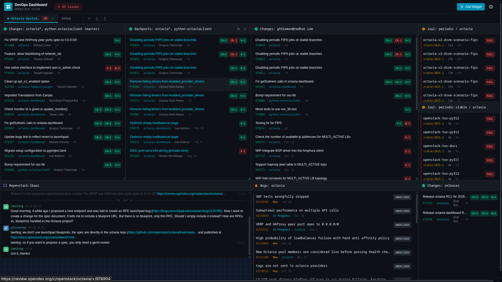

# Developer Dashboard

A modular dashboard for tracking development work across Gerrit, Zuul, and other platforms.



## Quick Start

```bash
# Install dependencies
npm install

# Start development servers (backend + frontend)
npm run dev
```

- Frontend: http://localhost:5173
- Backend: http://localhost:3001

## Project Structure

```
dashboard/
├── backend/          # Express + TypeScript + SQLite
│   ├── src/
│   │   ├── db/       # Database schema and initialization
│   │   ├── providers/ # Gerrit/Zuul API providers
│   │   ├── routes/   # REST API endpoints
│   │   └── services/ # Caching and business logic
│   └── data/         # SQLite database (auto-created)
├── frontend/         # React + TypeScript + Vite + Tailwind
│   └── src/
│       ├── components/
│       │   ├── dashboard/  # Grid layout components
│       │   ├── settings/   # Configuration modals
│       │   └── widgets/    # Widget implementations
│       ├── hooks/          # React Query hooks
│       ├── services/       # API client
│       └── store/          # Zustand state
└── shared/           # Shared TypeScript types
```

## Features

- **Drag-and-drop dashboard**: Arrange widgets freely with react-grid-layout
- **Gerrit widgets**: Recent changes, my changes needing attention
- **Zuul widgets**: Failed periodic jobs
- **Configurable data sources**: Add multiple Gerrit/Zuul instances
- **Optional authentication**: Store credentials for authenticated Gerrit access
- **Auto-refresh**: Widgets refresh automatically based on configured interval

## API Endpoints

| Endpoint | Description |
|----------|-------------|
| `GET /api/v1/widgets` | List all widgets |
| `POST /api/v1/widgets` | Create a widget |
| `PUT /api/v1/widgets/:id` | Update a widget |
| `DELETE /api/v1/widgets/:id` | Delete a widget |
| `GET /api/v1/layout` | Get dashboard layout |
| `PUT /api/v1/layout` | Save dashboard layout |
| `GET /api/v1/datasources` | List data sources |
| `GET /api/v1/proxy/gerrit/changes` | Proxy Gerrit queries |
| `GET /api/v1/proxy/zuul/builds` | Proxy Zuul queries |
| `GET /api/v1/summary` | Get dashboard summary |

## Verification

```bash
# Test Gerrit proxy
curl "http://localhost:3001/api/v1/proxy/gerrit/changes?q=project:openstack/octavia+status:open&n=5"

# Test Zuul proxy
curl "http://localhost:3001/api/v1/proxy/zuul/builds?project=openstack/octavia&pipeline=periodic&limit=5"
```

## Adding New Widget Types

1. Add type to `shared/types/index.ts`
2. Create widget component in `frontend/src/components/widgets/`
3. Register in `WidgetContainer.tsx` switch statement
4. Add to `WidgetPicker.tsx` widget types array
5. Update backend providers if needed
