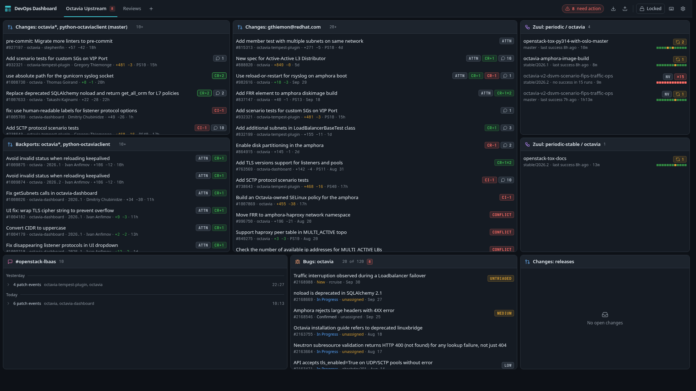

# Developer Dashboard

A dashboard for OpenStack upstream work: Gerrit reviews, Zuul periodic jobs, Launchpad bugs and IRC
channels, with the items that need your action surfaced first.



## Quick Start

```bash
# Install dependencies
npm install

# Build the shared types (the frontend and backend read shared/dist)
npm run build -w shared

# Start development servers (backend + frontend)
npm run dev
```

- Frontend: http://localhost:5173
- Backend: http://localhost:3001

Other scripts:

```bash
npm test        # unit tests (Vitest)
npm run lint    # ESLint on backend and frontend
npm run build   # production build of shared, backend and frontend
```

## Features

- **Dashboards as tabs**, with a drag-and-drop grid of widgets (react-grid-layout). Each tab is
  locked by default; unlock it to add, move, resize or configure widgets. Dashboards can be
  exported and imported as JSON.
- **Needs-action and new-item signals**: each widget header shows its item count and how many
  items need your action; the top bar sums them for the current dashboard, and new items (within a
  configurable window) are marked with a dot.
- **Gerrit widgets**: recent changes of projects/branches, your changes needing attention, another
  user's changes, and custom queries. Each change shows one action chip (`APPROVE` when ready for
  your Workflow +1, `CONFLICT`, `CI-1`, `ATTN` when you are in its attention set), compact votes
  (`CR+2×2`, `CR-1`, `W+1`, your own vote outlined), unresolved comments, size and patch set.
  Actionable changes are sorted first; WIP, DNM and bot changes are dimmed and sorted last.
- **Zuul widget**: failing jobs of a pipeline (e.g. periodic), grouped by job and branch, with a
  sparkline of recent results, the failure streak, the last success and a non-voting marker.
  Automatic retries are shown as warnings.
- **Launchpad widget**: open bugs of a project, with new (untriaged) bugs and unassigned in-progress
  bugs highlighted.
- **IRC widget**: recent channel messages; bot messages are collapsed into expandable groups.
- **Keyboard shortcuts**: `1`-`9` switch dashboards, `[`/`]` previous/next, `r` refreshes all
  widgets, `l` locks/unlocks, `a` adds a widget, `?` lists them.
- **Configurable data sources** with optional credentials (e.g. for authenticated Gerrit access,
  which enables the "your vote" and attention-set features).

## Security

There is no authentication: anyone who can reach the backend can read and change its
configuration, including the data sources that credentials are sent to. Credentials are stored in
plain text in the SQLite database (`backend/data/`, not committed). Run it on a trusted machine or
network only, and prefer revocable tokens (e.g. the Gerrit HTTP password) over real passwords.

## Project Structure

```
dashboard/
├── backend/          # Express + TypeScript + SQLite
│   ├── src/
│   │   ├── db/       # Database schema and initialization
│   │   ├── providers/ # Gerrit/Zuul/Launchpad/IRC API clients
│   │   ├── routes/   # REST API endpoints
│   │   └── services/ # Caching and logging
│   └── data/         # SQLite database (auto-created)
├── frontend/         # React + TypeScript + Vite + Tailwind
│   └── src/
│       ├── components/
│       │   ├── dashboard/  # Tabs, grid and widget frame
│       │   ├── layout/     # Top bar
│       │   ├── settings/   # Modals (settings, widget picker/config, shortcuts)
│       │   ├── ui/         # Shared UI primitives (chips, rows, buttons, forms, icons)
│       │   └── widgets/    # Widget implementations
│       ├── hooks/          # React Query hooks, keyboard shortcuts
│       ├── lib/            # Formatting and other helpers
│       ├── services/       # API client
│       └── store/          # Zustand state
└── shared/           # Shared TypeScript types
```

## API Endpoints

| Endpoint | Description |
|----------|-------------|
| `GET/POST /api/v1/dashboards` | List / create dashboards |
| `GET/PUT/DELETE /api/v1/dashboards/:id` | Get / update (name, layout) / delete a dashboard |
| `POST /api/v1/dashboards/reorder` | Reorder dashboards |
| `GET /api/v1/dashboards/:id/export`, `POST /api/v1/dashboards/import` | Export / import a dashboard |
| `GET/POST /api/v1/widgets` | List (`?dashboardId=`) / create widgets |
| `GET/PUT/DELETE /api/v1/widgets/:id` | Get / update / delete a widget |
| `GET/POST /api/v1/datasources`, `GET/PUT/DELETE /api/v1/datasources/:id` | Data sources |
| `GET/POST /api/v1/credentials`, `GET/PUT/DELETE /api/v1/credentials/:dataSourceId` | Credentials (passwords are never returned) |
| `GET /api/v1/proxy/gerrit/changes` | Proxy Gerrit queries (`q`, `n`) |
| `GET /api/v1/proxy/gerrit/self` | Authenticated Gerrit account (`null` without credentials) |
| `GET /api/v1/proxy/zuul/builds` | Proxy Zuul builds |
| `GET /api/v1/proxy/launchpad/bugs` | Proxy Launchpad bugs (total in `X-Total-Count`) |
| `GET /api/v1/proxy/irc/messages` | Proxy IRC channel logs |
| `POST /api/v1/proxy/cache/refresh` | Drop the short-lived proxy cache (manual refresh) |
| `GET/PUT /api/v1/layout` | Legacy single-layout API (superseded by dashboards) |
| `GET /health` | Health check |

All proxy endpoints take a `dataSourceId` and are cached in the backend (5 minutes by default,
`CACHE_TTL`).

## Verification

```bash
# Test Gerrit proxy
curl "http://localhost:3001/api/v1/proxy/gerrit/changes?q=project:openstack/octavia+status:open&n=5"

# Test Zuul proxy
curl "http://localhost:3001/api/v1/proxy/zuul/builds?project=openstack/octavia&pipeline=periodic&limit=5"
```

## Adding New Widget Types

1. Add the type to `WidgetType` in `shared/types/index.ts` (and to the seed in
   `backend/src/db/schema.sql`)
2. Create the widget component in `frontend/src/components/widgets/`, built from the primitives in
   `components/ui/`, and report its signals with `reportWidgetSignals`
3. Register it in `frontend/src/components/dashboard/WidgetContainer.tsx` (source icon, title,
   search link, render switch)
4. Add it to the catalog in `frontend/src/components/settings/widgetTypes.ts` and its fields to
   `WidgetConfigFields.tsx`
5. Update the backend providers and proxy routes if it needs new data
